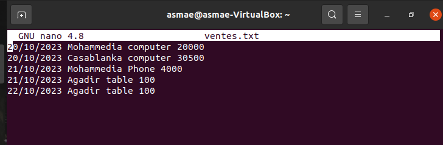
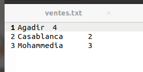
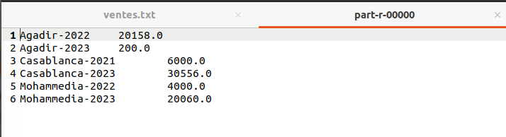
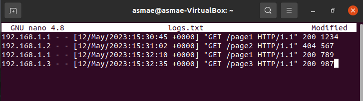
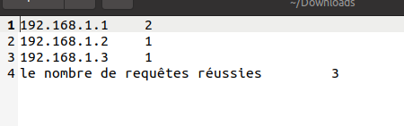

<h1>Big Data: Fondements et Architectures de stockage</h1>
 
<h6>Enset Mohammedia - Master SDIA</h6>
<h6>El hyani Asmae</h6>
 
<h3>TP2 Simple Exercices sur MapReduce</h3>
<h5>Exercice 1</h5>
<h5>Partie 1</h5>

Un Job Map Reduce permettant, à partir d’un
fichier texte (ventes.txt) en entré, contenant les ventes d’une entreprise dans
les différentes villes, de déterminer le total des ventes par ville. La structure
du fichier ventes.txt est de la forme suivante :
date ville produit prix

<h6>Creation de fichier texte (ventes.txt) </h6>

Ajouter le fichie sur hadoop avec la commande (hdfs dfs -put ventes.txt /)

<h6>Mapper Class</h6>
<pre>
import org.apache.hadoop.io.IntWritable;
import org.apache.hadoop.io.LongWritable;
import org.apache.hadoop.io.Text;
import org.apache.hadoop.mapreduce.Mapper;

import java.io.IOException;

public class VilleCountMapper extends Mapper<LongWritable, Text,Text,IntWritable> {
@Override
protected void map(LongWritable key, Text value, Mapper<LongWritable, Text, Text, IntWritable>.Context context) throws IOException, InterruptedException {
String data[]= value.toString().split(" ");
String city=data[1];
context.write(new Text(city),new IntWritable(1));
    }
}
</pre>
<h6>Reduce Class</h6>
<pre>
import org.apache.hadoop.io.IntWritable;
import org.apache.hadoop.io.Text;
import org.apache.hadoop.mapreduce.Reducer;

import java.io.IOException;
import java.util.Iterator;

public class VilleCountReducer extends Reducer<Text, IntWritable,Text,IntWritable> {
@Override
protected void reduce(Text key, Iterable<IntWritable> values, Reducer<Text, IntWritable, Text, IntWritable>.Context context) throws IOException, InterruptedException {
Iterator<IntWritable> it=values.iterator();
int somme=0;
while (it.hasNext()){
somme+=it.next().get();
}
context.write(key,new IntWritable(somme));
}
}
</pre>
<h6>Job Class</h6>
<pre>
public class VilleCountDriver {
    public static void main(String[] args) throws Exception {
        Configuration conf=new Configuration();
        Job job=Job.getInstance(conf);
        //les classes Mapper et Reducer
        job.setMapperClass(VilleCountMapper.class);
        job.setReducerClass(VilleCountReducer.class);
        //les types de sortie de la fonction map
        job.setMapOutputKeyClass(Text.class);
        job.setMapOutputValueClass(IntWritable.class);
        //les types de sotie du job
        job.setOutputKeyClass(Text.class);
        job.setOutputValueClass(IntWritable.class);
        //le fomat input
        job.setInputFormatClass(TextInputFormat.class);
        //le path des fichiers input/output
        FileInputFormat.addInputPath(job,new Path(args[0]));
        FileOutputFormat.setOutputPath(job,new Path(args[1]));
        job.waitForCompletion(true);
    }
}
</pre>
<h6>Run application</h6>

hadoop jar TP1_MapReduce-1.0-SNAPSHOT.jar org.example1.VilleCountDriver /ventes.txt /output

<h5>Partie 2</h5>

un deuxième job permettant de calculer le prix total des ventes
des produits par ville pour une année donnée.

<h6>Mapper Class</h6>
<pre>
import org.apache.hadoop.io.DoubleWritable;
import org.apache.hadoop.io.LongWritable;
import org.apache.hadoop.io.Text;
import org.apache.hadoop.mapreduce.Mapper;

import java.io.IOException;

public class SalesMapper extends Mapper<LongWritable, Text,Text,DoubleWritable> {
@Override
protected void map(LongWritable key, Text value,Context context) throws IOException, InterruptedException {
String[] cities= value.toString().split(" ");
if(cities.length==4){
String cityYear=cities[1]+"-"+cities[0];
double price=Double.parseDouble(cities[3]);
context.write(new Text(cityYear),new DoubleWritable(price));
}
}
}
</pre>
<h6>Reduce Class</h6>
<pre>
public class SalesReducer<.Texte> extends Reducer<.Texte, DoubleWritable,Texte,DoubleWritable> {
    @Override
    protected void reduce(Texte key, Iterable<.DoubleWritable> values, Reducer<.Texte, DoubleWritable, Texte, DoubleWritable>.Context context) throws IOException, InterruptedException {
        double totalSales=0;
        for (DoubleWritable value:values) {
            totalSales+=value.get();
        }
        context.write(key,new DoubleWritable(totalSales));
    }
}
</pre>
<h6>Job Class</h6>
<pre>
public class SalesDriver {
    public static void main(String[] args) throws Exception {
        Configuration conf=new Configuration();
        Job job=Job.getInstance(conf);
        //les classes Mapper et Reducer
        job.setMapperClass(SalesMapper.class);
        job.setReducerClass(SalesReducer.class);
        //les types de sortie de la fonction map
        job.setMapOutputKeyClass(Text.class);
        job.setMapOutputValueClass(DoubleWritable.class);
        //les types de sotie du job
        job.setOutputKeyClass(Text.class);
        job.setOutputValueClass(DoubleWritable.class);
        //le fomat input
        job.setInputFormatClass(TextInputFormat.class);
        //le path des fichiers input/output
        FileInputFormat.addInputPath(job,new Path(args[0]));
        FileOutputFormat.setOutputPath(job,new Path(args[1]));
        job.waitForCompletion(true);
    }
}
</pre>
<h6>Run application</h6>

 
<h5>Exercice 2</h5>

On dispose d’un grand ensemble de fichiers journaux (logs) Web générés par un
serveur. Chaque ligne du fichier journal contient des informations sur les requêtes
HTTP, y compris l'adresse IP du client, la date, le chemin d'accès demandé, le
code de réponse HTTP, etc. L'objectif est d'effectuer une analyse des logs pour
trouver le nombre total de requêtes par adresse IP, ainsi que le nombre de requêtes
réussies (code de réponse HTTP 200) par adresse IP.

<h6>Creation de fichier texte (logs.txt) </h6>
<pre>192.168.1.1 - - [12/May/2023:15:30:45 +0000] "GET /page1 HTTP/1.1" 200 1234
192.168.1.2 - - [12/May/2023:15:31:02 +0000] "GET /page2 HTTP/1.1" 404 567
192.168.1.1 - - [12/May/2023:15:32:10 +0000] "GET /page1 HTTP/1.1" 200 789
192.168.1.3 - - [12/May/2023:15:32:35 +0000] "GET /page3 HTTP/1.1" 200 987</pre>

Ajouter le fichie sur hadoop avec la commande (hdfs dfs -put logs.txt /)

<h6>Mapper Class</h6>
<pre>
import org.apache.hadoop.io.IntWritable;
import org.apache.hadoop.io.LongWritable;
import org.apache.hadoop.io.Text;
import org.apache.hadoop.mapreduce.Mapper;

import java.io.IOException;
import java.util.Objects;

public class RequestCountMapper extends Mapper<LongWritable, Text,Text, IntWritable> {
    @Override
    protected void map(LongWritable key, Text value,Context context) throws IOException, InterruptedException {
        String[] data= value.toString().split(" ");
        String ipAdd=data[0];
        String codeRq=data[8];
        context.write(new Text(ipAdd),new IntWritable(1));
        if(Objects.equals(codeRq, "200")){
            context.write(new Text("le nombre de requêtes réussies"),new IntWritable(1));
        }
        }
}
</pre>
<h6>Reduce Class</h6>
<pre>
public class RequestCountReducer<.Texte> extends Reducer<.Texte, IntWritable,Texte,IntWritable> {
    @Override
    protected void reduce(Texte key, Iterable<.IntWritable> values, Reducer<.Texte, IntWritable, Texte, IntWritable>.Context context) throws IOException, InterruptedException {
        int count=0;
        for (IntWritable value:values) {
            count+=value.get();
        }
        context.write(key,new IntWritable(count));
    }
}
</pre>
<h6>Job Class</h6>
<pre>
public class RequestCountDriver {
    public static void main(String[] args) throws Exception {
        Configuration conf=new Configuration();
        Job job=Job.getInstance(conf);
        //les classes Mapper et Reducer
        job.setMapperClass(RequestCountMapper.class);
        job.setReducerClass(RequestCountReducer.class);
        //les types de sortie de la fonction map
        job.setMapOutputKeyClass(Text.class);
        job.setMapOutputValueClass(IntWritable.class);
        //les types de sotie du job
        job.setOutputKeyClass(Text.class);
        job.setOutputValueClass(IntWritable.class);
        //le fomat input
        job.setInputFormatClass(TextInputFormat.class);
        //le path des fichiers input/output
        FileInputFormat.addInputPath(job,new Path(args[0]));
        FileOutputFormat.setOutputPath(job,new Path(args[1]));
        job.waitForCompletion(true);
    }
}
</pre>
<h6>Run application</h6>

