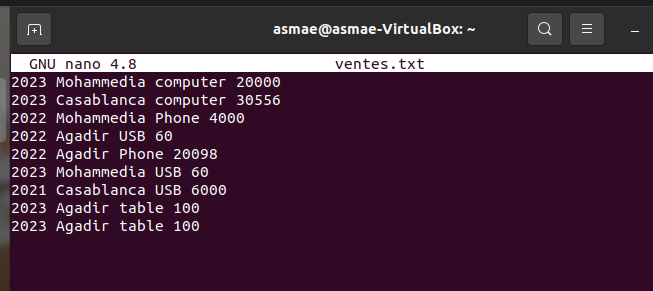

<h1>Big Data: Fondements et Architectures de stockage</h1>
 
<h6>Enset Mohammedia - Master SDIA</h6>
<h6>El hyani Asmae</h6>
 
<h3>TP2 Simple Exercices sur MapReduce</h3>
<h5>Exemple 1</h5>
<h5>Partie 1</h5>

Un Job Map Reduce permettant, à partir d’un
fichier texte (ventes.txt) en entré, contenant les ventes d’une entreprise dans
les différentes villes, de déterminer le total des ventes par ville. La structure
du fichier ventes.txt est de la forme suivante :
date ville produit prix

<h6>Creation de fichier texte (ventes.txt) </h6>

Ajouter le fichie sur hadoop avec la commande (hdfs dfs -put ventes.txt /)

<h6>Mapper Class</h6>
<pre>
</pre>
<h6>Reduce Class</h6>
<pre>
</pre>
<h6>Job Class</h6>
<pre>
</pre>
<h6>Run application</h6>

<h5>Partie 2</h5>

un deuxième job permettant de calculer le prix total des ventes
des produits par ville pour une année donnée.

<h6>Mapper Class</h6>
<pre>
</pre>
<h6>Reduce Class</h6>
<pre>
</pre>
<h6>Job Class</h6>
<pre>
</pre>
<h6>Run application</h6>

